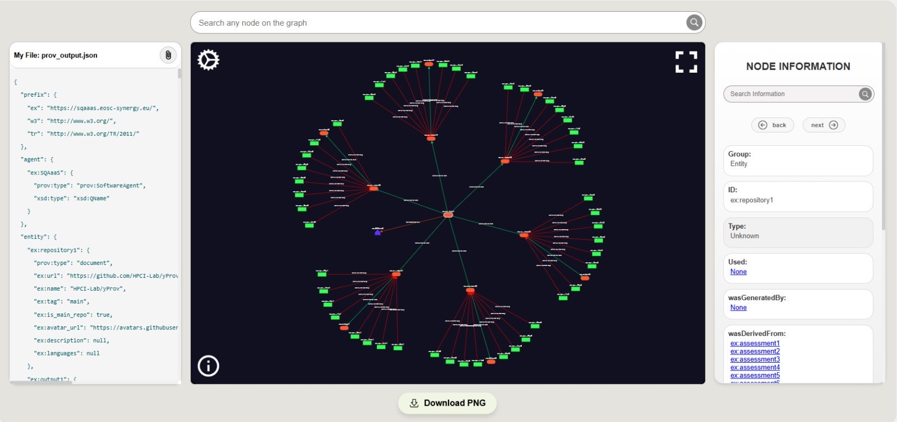

Versione in inglese [qui](README_ENG.md)

---


# yProv Explorer

Un potente strumento web basato su **React** e **D3.js** per visualizzare e interagire con grafici di Provenance. Permette di caricare dati da file JSON o URL, e offre funzioni interattive per l’esplorazione di grafici di grandi dimensioni, con diverse opzioni di personalizzazione e condivisione.

---

## 📖 Indice

1. [Introduzione](#introduzione)
2. [Struttura del Progetto](#struttura-del-progetto)
3. [Screenshot](#screenshot)
4. [Funzionalità Principali](#funzionalità-principali)
5. [Live Demo](#live-demo)
6. [Installazione](#installazione)
   - [Prerequisiti](#prerequisiti)
   - [Steps](#steps)
7. [Utilizzo](#utilizzo)
   - [Caricamento Grafici](#caricamento-grafici)
   - [Esplorazione Interattiva](#esplorazione-interattiva)
   - [Condivisione dei Nodi](#condivisione-dei-nodi)
8. [Sviluppatori](#sviluppatori)

---

## Introduzione 🚀

**yProv Explorer** è un’applicazione pensata per fornire una visione immediata e intuitiva della Provenance. Grazie a **React** e **D3.js**, è possibile navigare in modo dinamico e interattivo tra entità, agenti e attività, evidenziando relazioni e collegamenti.

---

## Struttura del Progetto 🏗️

Ecco una panoramica semplificata:

```
yProv-Explorer/
├── captures/
│   ├── example1.jpeg
│   ├── example2.png
│   └── example3.jpeg
├── netlify/
│   └── functions/
│       └── proxy.js
├── public/
├── src/
│   ├── assets/
│   ├── components/
│   │   ├── DownloadsButton/
│   │   ├── FileUploadButton/
│   │   ├── FullscreenButton/
│   │   ├── Graph/
│   │   ├── GraphContainer/
│   │   ├── GraphInfo/
│   │   ├── GraphSettings/
│   │   ├── JsonLabel/
│   │   ├── NavigationButton/
│   │   ├── NodeInfo/
│   │   ├── SearchBar/
│   │   └── SearchNode/
│   ├── main/
│   │   ├── main.css
│   │   └── Main.js
│   ├── App.js
│   ├── index.css
│   ├── index.js
│   ├── proxy-server.mjs
│   ├── reportWebVitals.js
│   ├── setupTests.js
│   └── unified-loader.js
├── utilities/
│   └── provenance_creator.py
├── .gitignore
├── LICENSE
├── netlify.toml
├── package-lock.json
├── package.json
├── README_ENG.md
└── README.md
```

---

## Screenshot 📸

Ecco un'anteprima del grafo generato dall'applicazione:



- I **nodi arancioni** (rettangoli con angoli smussati) rappresentano **le entità**.
- I **rettangoli verdi** rappresentano **le attività**.
- Il **nodo a forma di casa viola** rappresenta **un agente**.
- I **collegamenti rossi** rappresentano **“wasGeneratedBy”**.
- I **collegamenti verdi** rappresentano **“wasDerivedFrom”**.
- Il **collegamento arancione** rappresenta **“wasAttributedTo”**.

Ora la sezione **Screenshot** è ben organizzata e chiara. Se vuoi aggiungere altre immagini o ulteriori dettagli, fammelo sapere! 🚀

---

## Funzionalità Principali 🌟

- **Esplorazione interattiva del grafico:** Pan, zoom e trascinamento dei nodi.
- **Visualizzazione personalizzabile:** Alterna le etichette dei nodi, le etichette dei collegamenti e controlla la distanza tra i nodi.
- **Caricamento file e supporto URL:** Carica grafici tramite upload di file o incollando l’URL.
- **Evidenziazione e condivisione dei nodi:** Clicca sui nodi per evidenziarli, aggiornare l’URL con il nodo selezionato e condividere il link diretto.
- **Controllo della visibilità dei link:** Mostra o nasconde tipi specifici di link (ad esempio, “used”, “wasDerivedFrom”, “wasGeneratedBy”).
- **Visualizzazione a schermo intero:** Massimizza il grafico per un’analisi più accurata.
- **Navigazione tramite cronologia:** Utilizza la barra del browser per spostarti fra i nodi precedentemente cliccati.
- **Statistiche del grafico:** Visualizza il totale dei nodi e la ripartizione per tipo (entità, attività, agente).
- **Navigazione dei collegamenti dei nodi:** Segui i collegamenti di un nodo nel pannello dei dettagli.
- **Esporta schermata del grafico:** Salva la vista del grafico corrente in formato PNG.

---

## Live Demo 🔗

Visita l’applicazione distribuita su Netlify per un’anteprima:

👉 [Demo Online](https://yprovexplorer.netlify.app/)

---

## Installazione ⚙️

Vuoi eseguire il progetto in locale? Di seguito i passaggi:

### Prerequisiti

- **Node.js** (v16 o superiore consigliata)
- **npm**

### Steps

1. **Clona il repository** e accedi alla directory:
   ```bash
   git clone https://github.com/Zefkilis2002/yProv-Explorer
   cd yProv-Explorer
   ```
2. **Installa le dipendenze**:
   ```bash
   npm install
   npm start
   ```
3. **Apri il browser** su [http://localhost:3000](http://localhost:3000) per visualizzare l’app.

---

## Utilizzo 🖥️

### Caricamento Grafici

- **Caricamento da File:** Fai clic sul pulsante di caricamento, seleziona un file JSON contenente la Provenance.
- **Caricamento da URL:** Incolla l’URL di un file JSON o di un endpoint REST.

### Esplorazione Interattiva

- **Pan e Zoom:** Usa il mouse o i controlli dedicati per navigare.
- **Selezione dei Nodi:** Clicca su un nodo per visualizzare informazioni aggiuntive.
- **Distanza Nodi:** Personalizza la forza di repulsione/attrazione per ottimizzare la visualizzazione.

### Condivisione dei Nodi

- **URL Dinamico:** Una volta cliccato il nodo, l’URL viene aggiornato con un parametro che identifica il nodo selezionato.
- **Link Diretto:** Condividi questo URL in modo che chiunque possa accedere direttamente allo stesso nodo.

---

## Sviluppatori 👨‍💻
 - Konstantinos Zefkilis;
 - Sandro Luigi Fiore;
 - Marco Robol.


```
yprov-explorer
├─ .dockerignore
├─ captures
│  ├─ example1.jpeg
│  ├─ example2.png
│  └─ example3.jpeg
├─ docker
│  ├─ Dockerfile.backend
│  └─ Dockerfile.frontend
├─ docker-compose.yml
├─ gnu-gpl-v3.0.md
├─ LICENSE
├─ package-lock.json
├─ package.json
├─ public
│  ├─ favicon.ico
│  ├─ index.html
│  ├─ logo192.png
│  ├─ logo512.png
│  ├─ manifest.json
│  └─ robots.txt
├─ README.md
├─ README_ENG.md
├─ src
│  ├─ App.js
│  ├─ assets
│  │  └─ images
│  │     ├─ fullscreen-max.png
│  │     ├─ fullscreen-min.png
│  │     └─ leftArrow.png
│  ├─ components
│  │  ├─ DownloadsButton
│  │  │  ├─ download.png
│  │  │  ├─ downloadsButton.css
│  │  │  └─ DownloadsButton.js
│  │  ├─ FileUploadButton
│  │  │  ├─ Attach.png
│  │  │  ├─ fileUploadButton.css
│  │  │  └─ FileUploadButton.js
│  │  ├─ FullscreenButton
│  │  │  ├─ fullscreenButton.css
│  │  │  └─ FullscreenButton.js
│  │  ├─ Graph
│  │  │  ├─ graph.css
│  │  │  └─ Graph.js
│  │  ├─ GraphContainer
│  │  │  ├─ graphContainer.css
│  │  │  └─ GraphContainer.js
│  │  ├─ GraphInfo
│  │  │  ├─ graphInfo.css
│  │  │  ├─ GraphInfo.js
│  │  │  └─ info.png
│  │  ├─ GraphSettings
│  │  │  ├─ graphSettings.css
│  │  │  ├─ GraphSettings.js
│  │  │  └─ Settings.png
│  │  ├─ JsonLabel
│  │  │  ├─ jsonLabel.css
│  │  │  └─ JsonLabel.js
│  │  ├─ NavigationButton
│  │  │  ├─ Back Arrow.png
│  │  │  ├─ Forward Arrow.png
│  │  │  ├─ navigationButton.css
│  │  │  └─ NavigationButton.js
│  │  ├─ NodeInfo
│  │  │  ├─ nodeInfo.css
│  │  │  └─ NodeInfo.js
│  │  ├─ SearchBar
│  │  │  ├─ search.png
│  │  │  ├─ searchBar.css
│  │  │  └─ SearchBar.js
│  │  └─ SearchNode
│  │     ├─ search.png
│  │     ├─ searchNode.css
│  │     └─ SearchNode.js
│  ├─ index.css
│  ├─ index.js
│  ├─ main
│  │  ├─ main.css
│  │  └─ Main.js
│  ├─ reportWebVitals.js
│  ├─ server
│  │  ├─ proxy-server.mjs
│  │  └─ unified-loader.js
│  └─ setupTests.js
└─ utilities
   └─ provenance_creator.py

```